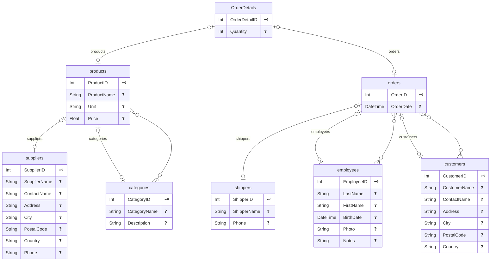

```mermaid
erDiagram

  "OrderDetails" {
    Int OrderDetailID "🗝️"
    Int Quantity "❓"
    }
  

  "categories" {
    Int CategoryID "🗝️"
    String CategoryName "❓"
    String Description "❓"
    }
  

  "customers" {
    Int CustomerID "🗝️"
    String CustomerName "❓"
    String ContactName "❓"
    String Address "❓"
    String City "❓"
    String PostalCode "❓"
    String Country "❓"
    }
  

  "employees" {
    Int EmployeeID "🗝️"
    String LastName "❓"
    String FirstName "❓"
    DateTime BirthDate "❓"
    String Photo "❓"
    String Notes "❓"
    }
  

  "orders" {
    Int OrderID "🗝️"
    DateTime OrderDate "❓"
    }
  

  "products" {
    Int ProductID "🗝️"
    String ProductName "❓"
    String Unit "❓"
    Float Price "❓"
    }
  

  "shippers" {
    Int ShipperID "🗝️"
    String ShipperName "❓"
    String Phone "❓"
    }
  

  "suppliers" {
    Int SupplierID "🗝️"
    String SupplierName "❓"
    String ContactName "❓"
    String Address "❓"
    String City "❓"
    String PostalCode "❓"
    String Country "❓"
    String Phone "❓"
    }
  
    "OrderDetails" o|--|o "products" : "products"
    "OrderDetails" o|--|o "orders" : "orders"
    "categories" o{--}o "products" : ""
    "customers" o{--}o "orders" : ""
    "employees" o{--}o "orders" : ""
    "orders" o|--|o "shippers" : "shippers"
    "orders" o|--|o "employees" : "employees"
    "orders" o|--|o "customers" : "customers"
    "products" o|--|o "suppliers" : "suppliers"
    "products" o|--|o "categories" : "categories"
```
