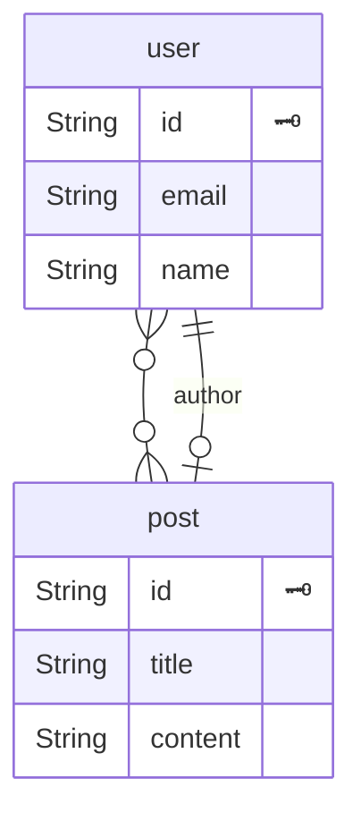

```mermaid
erDiagram

  "user" {
    String id "🗝️"
    String email 
    String name 
    }
  

  "post" {
    String id "🗝️"
    String title 
    String content 
    }
  
    "user" o{--}o "post" : ""
    "post" o|--|| "user" : "author"
```
