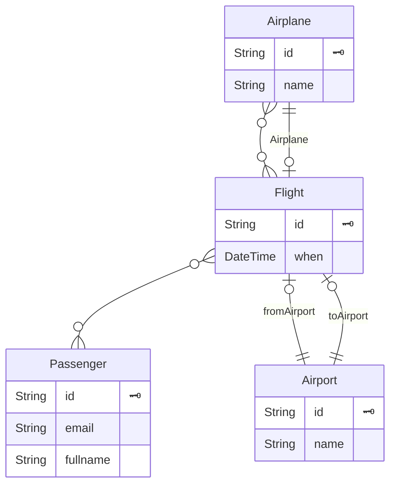

```mermaid
erDiagram

  "Airplane" {
    String id "🗝️"
    String name 
    }
  

  "Flight" {
    String id "🗝️"
    DateTime when 
    }
  

  "Airport" {
    String id "🗝️"
    String name 
    }
  

  "Passenger" {
    String id "🗝️"
    String email 
    String fullname 
    }
  
    "Airplane" o{--}o "Flight" : ""
    "Flight" o{--}o "Passenger" : ""
    "Flight" o|--|| "Airport" : "fromAirport"
    "Flight" o|--|| "Airport" : "toAirport"
    "Flight" o|--|| "Airplane" : "Airplane"
```
