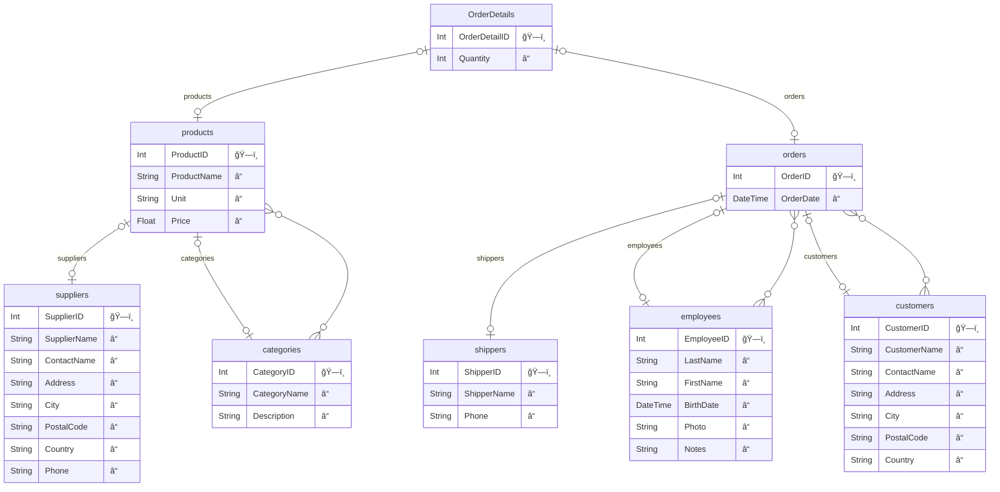

```mermaid
erDiagram

  "OrderDetails" {
    Int OrderDetailID "ğŸ—ï¸"
    Int Quantity "â“"
    }
  

  "categories" {
    Int CategoryID "ğŸ—ï¸"
    String CategoryName "â“"
    String Description "â“"
    }
  

  "customers" {
    Int CustomerID "ğŸ—ï¸"
    String CustomerName "â“"
    String ContactName "â“"
    String Address "â“"
    String City "â“"
    String PostalCode "â“"
    String Country "â“"
    }
  

  "employees" {
    Int EmployeeID "ğŸ—ï¸"
    String LastName "â“"
    String FirstName "â“"
    DateTime BirthDate "â“"
    String Photo "â“"
    String Notes "â“"
    }
  

  "orders" {
    Int OrderID "ğŸ—ï¸"
    DateTime OrderDate "â“"
    }
  

  "products" {
    Int ProductID "ğŸ—ï¸"
    String ProductName "â“"
    String Unit "â“"
    Float Price "â“"
    }
  

  "shippers" {
    Int ShipperID "ğŸ—ï¸"
    String ShipperName "â“"
    String Phone "â“"
    }
  

  "suppliers" {
    Int SupplierID "ğŸ—ï¸"
    String SupplierName "â“"
    String ContactName "â“"
    String Address "â“"
    String City "â“"
    String PostalCode "â“"
    String Country "â“"
    String Phone "â“"
    }
  
    "OrderDetails" o|--|o "products" : "products"
    "OrderDetails" o|--|o "orders" : "orders"
    "categories" o{--}o "products" : ""
    "customers" o{--}o "orders" : ""
    "employees" o{--}o "orders" : ""
    "orders" o|--|o "shippers" : "shippers"
    "orders" o|--|o "employees" : "employees"
    "orders" o|--|o "customers" : "customers"
    "products" o|--|o "suppliers" : "suppliers"
    "products" o|--|o "categories" : "categories"
```
